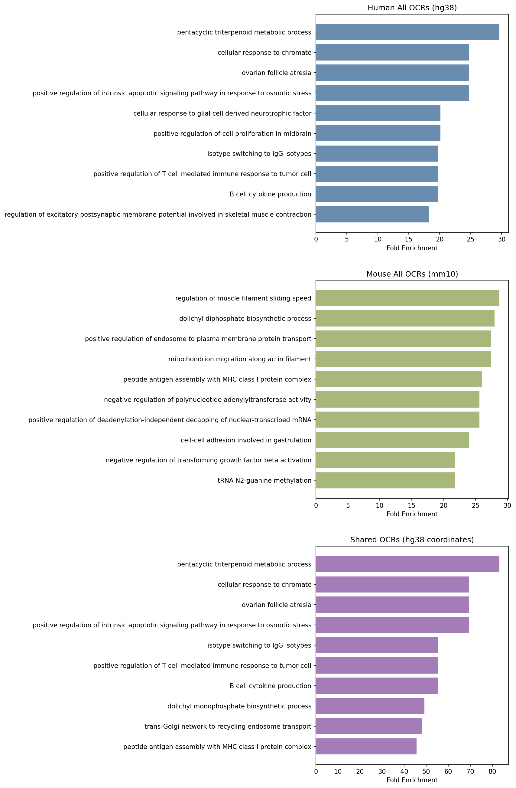
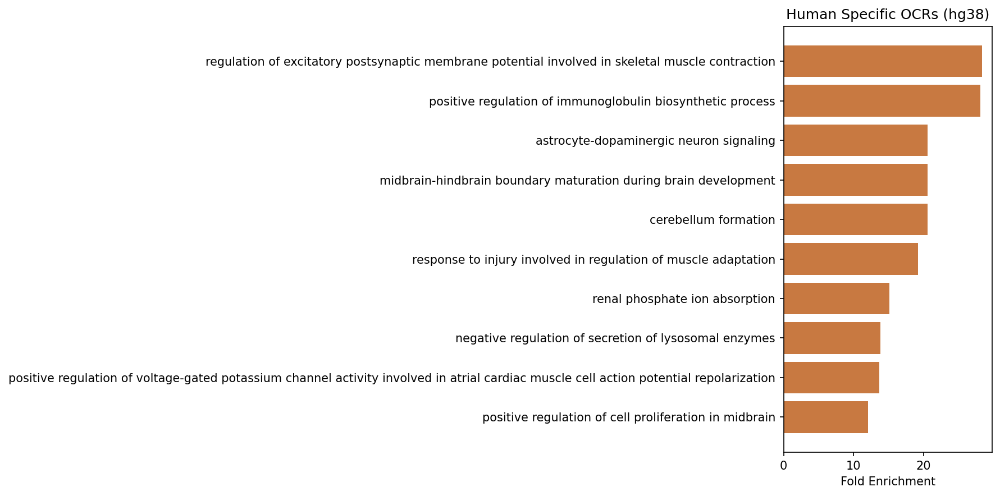
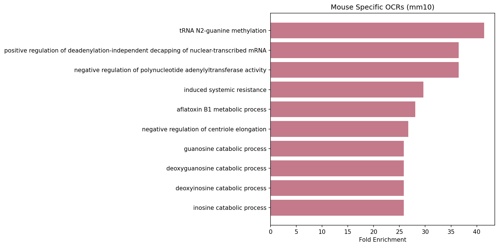

# Task 3: GO Biological Process Enrichment Analysis

## Overview
This task performs Gene Ontology (GO) Biological Process enrichment analysis on open chromatin regions (OCRs) from human (hg38) and mouse (mm10) adrenal gland ATAC-seq data using the rGREAT package. The results are visualized as bar plots of the top 10 enriched terms by fold enrichment for Shared, Human All, Human Specific Mouse All, and Mouse Specific.

## Input Files
- `human_adrenal_idr_optimal.HumanToMouse.no_mouse_native_overlap.bed` -> human-specific OCRs in hg38 coordinates
- `human_adrenal_idr_optimal.HumanToMouse.shared_with_mouse_native.bed` -> shared OCRs in hg38 coordinates
- `mouse_adrenal_idr_optimal.no_human_mapped_overlap.bed` -> mouse-specific OCRs in mm10 coordinates
- `mouse_adrenal_idr_optimal.shared_with_human_mapped.bed` -> shared OCRs in mm10 coordinates

## Scripts
- `run_rgreat.R` -> runs GREAT enrichment analysis for all OCR sets and saves filtered results
- `run.sbatch` -> SLURM job script to run `run_rgreat.R` on Bridges-2
- `top10_GO_BP_Plot.py` -> plots top 10 enriched GO BP terms for each OCR set
- `run_plot.sbatch` -> SLURM job script to run `top10_GO_BP_Plot.py` on Bridges-2

## How to Run
Run the enrichment analysis first, then the plotting script:
```bash
sbatch run.sbatch
sbatch run_plot.sbatch
```

## Output Files (`results/`)
| File | Description |
|------|-------------|
| `human_specific_BP_filtered.csv` | Significant GO BP terms for human-specific OCRs |
| `human_shared_BP_filtered.csv` | Significant GO BP terms for shared OCRs (hg38) |
| `all_human_BP_filtered.csv` | Significant GO BP terms for all human OCRs |
| `mouse_specific_BP_filtered.csv` | Significant GO BP terms for mouse-specific OCRs |
| `shared_mouse_BP_filtered.csv` | Significant GO BP terms for shared OCRs (mm10) |
| `all_mouse_BP_filtered.csv` | Significant GO BP terms for all mouse OCRs |
| `plots_combined.png` | Top 10 GO BP terms for human all, mouse all, and shared OCRs |
| `plots_human_specific.png` | Top 10 GO BP terms for human-specific OCRs |
| `plots_mouse_specific.png` | Top 10 GO BP terms for mouse-specific OCRs |

## Methods
OCR sets were submitted to GREAT using the `submitGreatJob()` function with the appropriate reference genome (hg38 for human, mm10 for mouse). GO Biological Process terms were filtered for significance (Benjamini-Hochberg adjusted p-value < 0.05) and ranked by binomial fold enrichment. The top 10 terms per OCR set were plotted as horizontal bar charts.

## Dependencies
- R with `rGREAT`, `GenomicRanges`, `BiocManager`
- Python with `pandas`, `matplotlib`

## Figures 




---

[Go back to main.](https://github.com/BioinformaticsDataPracticum2026/cross-species-regulatory-analysis#usage-step-by-step)