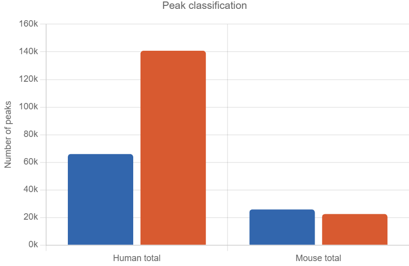
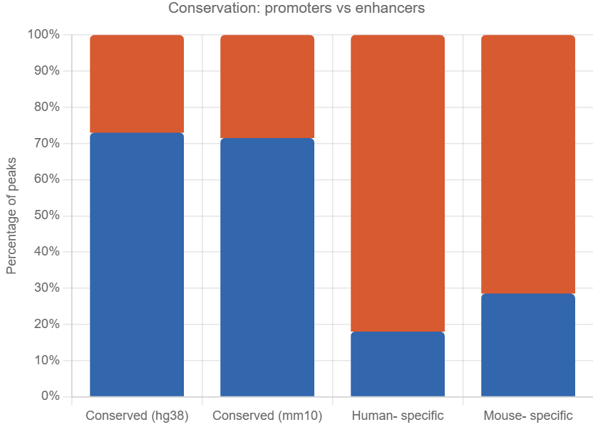

# Task 4: Enhancer and Promoter Classification

## Goal

Classify open chromatin regions (ATAC-seq peaks) as **promoters** or **enhancers** and compare their cross-species conservation between human and mouse adrenal gland.

## Method

Peaks were classified based on distance to Transcription Start Sites (TSS):

- **Promoter**: peak overlaps a +/-2kb window around any TSS
- **Enhancer**: peak does not overlap any TSS window

This window size captures the majority of known promoter-associated regulatory activity while minimizing inclusion of distal enhancer elements, consistent with standard practice in comparative regulatory analysis.

TSS positions were extracted from GENCODE gene annotations:

- Human: [GENCODE v45](https://ftp.ebi.ac.uk/pub/databases/gencode/Gencode_human/release_45/gencode.v45.basic.annotation.gtf.gz) (hg38)
- Mouse: [GENCODE vM25](https://ftp.ebi.ac.uk/pub/databases/gencode/Gencode_mouse/release_M25/gencode.vM25.basic.annotation.gtf.gz) (mm10)

Classification was performed using `bedtools intersect`:

- `-u` flag: peaks overlapping a TSS window (promoters)
- `-v` flag: peaks not overlapping any TSS window (enhancers)

## Dependencies

- **bedtools** (on Bridges-2: `module load bedtools`)
- **GENCODE v45** annotation for human (hg38) -- downloaded automatically by `extract_tss.sh`
- **GENCODE vM25** annotation for mouse (mm10) -- downloaded automatically by `extract_tss.sh`

## Input Files

These files come from Task 2 (Xingyu's cross-species mapping in `02.mapping/`):

| File | Format | Description | Coordinates |
|------|--------|-------------|-------------|
| `human_adrenal_idr_optimal.narrowPeak` | narrowPeak (BED6+4) | All human adrenal ATAC-seq peaks | Human (hg38) |
| `mouse_adrenal_idr_optimal.narrowPeak` | narrowPeak (BED6+4) | All mouse adrenal ATAC-seq peaks | Mouse (mm10) |
| `human_adrenal_idr_optimal.human_specific.original_human_coordinates.bed` | BED | Human-specific peaks | Human (hg38) |
| `human_adrenal_idr_optimal.shared.original_human_coordinates.bed` | BED | Conserved peaks (human side) | Human (hg38) |
| `mouse_adrenal_idr_optimal.shared_with_human_mapped.bed` | BED | Conserved peaks (mouse side) | Mouse (mm10) |
| `mouse_adrenal_idr_optimal.no_human_mapped_overlap.bed` | BED | Mouse-specific peaks | Mouse (mm10) |

## How to Run

1. Copy the input files from `02.mapping/` into your working directory.

2. Run the TSS extraction script to download GENCODE annotations and create TSS windows:
```bash
module load bedtools
bash extract_tss.sh
```
This produces `human_tss_2kb.bed` and `mouse_tss_2kb.bed`.

3. Run the classification script:
```bash
bash classifyingpeaks.sh
```
This classifies all peaks as promoters or enhancers and outputs the results.

## Output Files

All outputs are stored at `/ocean/projects/bio230007p/mkarne/task4/` on Bridges-2.

### Peak Classification (all peaks)

| File | Description | Count | Coordinates |
|------|-------------|-------|-------------|
| `humanpromoters.bed` | Human promoters | 65,958 | Human (hg38) |
| `humanenhancers.bed` | Human enhancers | 140,807 | Human (hg38) |
| `mouse_promoters.bed` | Mouse promoters | 25,790 | Mouse (mm10) |
| `mouse_enhancers.bed` | Mouse enhancers | 22,473 | Mouse (mm10) |

### Conservation Comparison (human coordinates)

| File | Description | Count | Coordinates |
|------|-------------|-------|-------------|
| `conserved_promoters_hg38.bed` | Conserved promoters | 25,773 | Human (hg38) |
| `conserved_enhancers_hg38.bed` | Conserved enhancers | 9,548 | Human (hg38) |
| `human_specific_promoters_hg38.bed` | Human-specific promoters | 11,462 | Human (hg38) |
| `human_specific_enhancers_hg38.bed` | Human-specific enhancers | 52,293 | Human (hg38) |

### Conservation Comparison (mouse coordinates)

| File | Description | Count | Coordinates |
|------|-------------|-------|-------------|
| `mouse_conserved_promoters.bed` | Conserved promoters | 20,003 | Mouse (mm10) |
| `mouse_conserved_enhancers.bed` | Conserved enhancers | 7,964 | Mouse (mm10) |
| `mousespecific_promoters.bed` | Mouse-specific promoters | 5,787 | Mouse (mm10) |
| `mousespecific_enhancers.bed` | Mouse-specific enhancers | 14,509 | Mouse (mm10) |

## Scripts

- `extract_tss.sh` -- Downloads GENCODE GTF files and extracts TSS positions with +/-2kb windows
- `classifyingpeaks.sh` -- Classifies peaks as promoters or enhancers using bedtools intersect

## Results

### Peak Classification

| Species | Promoters | Enhancers | % Promoters | % Enhancers |
|---------|-----------|-----------|-------------|-------------|
| Human | 65,958 | 140,807 | 31.9% | 68.1% |
| Mouse | 25,790 | 22,473 | 53.4% | 46.6% |

### Conservation Comparison

| Category | Promoters | Enhancers | % Promoters | % Enhancers |
|----------|-----------|-----------|-------------|-------------|
| Conserved (hg38) | 25,773 | 9,548 | 73.0% | 27.0% |
| Conserved (mm10) | 20,003 | 7,964 | 71.5% | 28.5% |
| Human-specific (hg38) | 11,462 | 52,293 | 18.0% | 82.0% |
| Mouse-specific (mm10) | 5,787 | 14,509 | 28.5% | 71.5% |

### Key Finding

Conserved peaks between human and mouse are predominantly promoters (~73% from human side, ~72% from mouse side), while species-specific peaks are predominantly enhancers (~82% for human-specific, ~71% for mouse-specific). This is consistent with the known biology that promoters are more evolutionarily conserved than enhancers, as promoters are located at gene starts which are shared between species, while enhancers regulate genes from a distance and evolve faster.

## Figures


*Grouped bar chart showing the number of promoters and enhancers in human and mouse adrenal gland ATAC-seq peaks.*


*Stacked bar chart showing the proportion of promoters vs enhancers across conserved, human-specific, and mouse-specific peak categories.*

## Directory Structure

```
04.promoter_enhancer/
├── README.md
├── extract_tss.sh
├── classifyingpeaks.sh
└── figures/
    ├── peak_classification.png
    └── conservation_comparison.png
```

## Citations

If using this pipeline in a manuscript, please cite:

- Quinlan, A. R. & Hall, I. M. BEDTools: A flexible suite of utilities for comparing genomic features. *Bioinformatics* 26, 841-842 (2010).
- Frankish, A. et al. GENCODE 2021. *Nucleic Acids Research* 49, D916-D923 (2021).
- Villar, D. et al. Enhancer evolution across 20 mammalian species. *Cell* 160, 554-566 (2015).

---

[Go back to main.](https://github.com/BioinformaticsDataPracticum2026/cross-species-regulatory-analysis#usage-step-by-step)