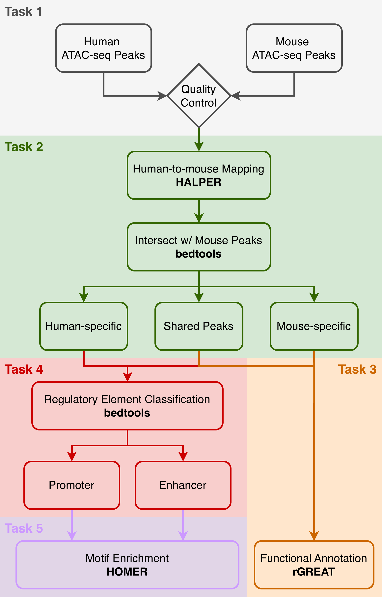

# Cross-Species Regulatory Analysis

This repository contains a reproducible analysis workflow for the 03-713 Bioinformatics Data Integration Practicum final project. The project compares human and mouse open chromatin in adrenal gland ATAC-seq data to identify shared and species-specific regulatory regions, annotate biological processes, classify regions as promoters or enhancers, and run motif enrichment analyses.

The final downstream workflow focuses on adrenal gland because it was selected after quality control of the assigned adrenal gland and ovary datasets.

## Table of Contents

- [Cross-Species Regulatory Analysis](#cross-species-regulatory-analysis)
  - [Workflow Overview](#workflow-overview)
  - [Table of Contents](#table-of-contents)
  - [Analysis Goals](#analysis-goals)
  - [Repository Layout](#repository-layout)
  - [Dependencies](#dependencies)
  - [Installation Notes](#installation-notes)
    - [Python Packages](#python-packages)
    - [bedtools](#bedtools)
    - [R and Bioconductor Packages](#r-and-bioconductor-packages)
    - [HAL and HALPER](#hal-and-halper)
    - [HOMER](#homer)
  - [Data Sources](#data-sources)
  - [Input Data](#input-data)
  - [Pipeline Overview](#pipeline-overview)
  - [Usage: Full Pipeline](#usage-full-pipeline)
  - [Usage: Step-by-Step](#usage-step-by-step)
  - [Main Outputs](#main-outputs)
  - [Team](#team)
  - [LLM Use](#llm-use)
  - [Citation](#citation)

## Analysis Goals

1. Evaluate dataset quality for human and mouse adrenal gland and ovary ATAC-seq data.
2. Map adrenal open chromatin regions between human and mouse.
3. Identify candidate biological processes associated with shared and species-specific open chromatin regions.
4. Classify open chromatin regions into promoter-like and enhancer-like sets.
5. Compare motif enrichment across shared and species-specific regulatory regions.
6. Provide a command-line pipeline that runs Tasks 2 to 5 on Bridges-2.

## Repository Layout

The repository is organized as a numbered workflow. Each folder contains a local README with step-specific details.

- `01.data/`: external data paths and selected input notes.
- `02.qc/`: quality-control analysis and tissue-selection summary.
- `03.mapping/`: cross-species mapping with HALPER and `bedtools`.
- `04.biological_processes/`: rGREAT biological process enrichment.
- `05.promoter_enhancer/`: promoter/enhancer classification using TSS windows.
- `06.motifs/`: HOMER motif enrichment and motif summaries.
- `07.pipeline/`: single-command downstream pipeline for Tasks 2 to 5.
- `08.results/`: final polished outputs for the report and presentation.

## Dependencies

The workflow was designed for the Bridges-2 Linux cluster environment.

Command-line tools:

- `bash`
- `awk`, `sort`, `cut`, `wc`, `gzip`
- `bedtools`
- `HAL` tools, including `halStats` and `halLiftover`
- `HALPER`
- `HOMER`
- `R`
- `Python 3`

R packages:

- `rGREAT`
- `GenomicRanges`
- `BiocManager`

Python packages:

- `pandas`
- `matplotlib`

`requirements.txt` only covers Python packages. HAL/HALPER, HOMER, bedtools, and R/Bioconductor packages should be installed or loaded through the cluster environment.

## Installation Notes

These commands are examples for setting up a compatible environment. On Bridges-2, some tools may already be available through modules or shared project directories.

### Python Packages

```bash
python3 -m pip install -r requirements.txt
```

### bedtools

On Bridges-2:

```bash
module load bedtools/2.30.0
```

With conda:

```bash
conda install -c bioconda bedtools
```

### R and Bioconductor Packages

Start R and install the required packages:

```r
install.packages("BiocManager")
BiocManager::install(c("rGREAT", "GenomicRanges"))
```

The Task 3 script also loads `BiocManager` to help install `rGREAT` if it is missing.

### HAL and HALPER

HALPER depends on the HAL toolkit. In a local or cluster setup, configure these paths in `pipeline.conf`:

```bash
HAL_BIN=/path/to/hal/bin
HALPER_DIR=/path/to/halLiftover-postprocessing
```

To install HALPER from source in another location:

```bash
git clone https://github.com/pfenninglab/halLiftover-postprocessing.git
```

Then make sure the HAL binaries are on `PATH` and HALPER is on `PYTHONPATH`:

```bash
export PATH=/path/to/hal/bin:$PATH
export PYTHONPATH=/path/to/halLiftover-postprocessing:$PYTHONPATH
```

Check that HAL is visible:

```bash
halStats --help
```

### HOMER

Install HOMER into a directory outside the repository:

```bash
mkdir -p /path/to/homer
cd /path/to/homer
curl -O http://homer.ucsd.edu/homer/configureHomer.pl
perl configureHomer.pl -install
perl configureHomer.pl -install mm10
perl configureHomer.pl -install hg38
```

Add HOMER to `PATH`:

```bash
export PATH=/path/to/homer/bin:$PATH
```

When running the full pipeline, provide this HOMER directory with:

```bash
HOMER_DIR=/path/to/homer
```

## Data Sources

Human adrenal gland ATAC-seq data were obtained from the [ENCODE portal](https://www.encodeproject.org/) using accession numbers ENCSR241OBO and ENCSR864ADD. Mouse adrenal gland ATAC-seq data were obtained from the public dataset reported by Liu et al. in *Scientific Data*: [An ATAC-seq atlas of chromatin accessibility in mouse tissues](https://doi.org/10.1038/s41597-019-0071-0).

## Input Data

Large data and reference files are accessed directly from shared Bridges-2 project directories instead of being stored in GitHub.

Default project paths:

- Human ATAC-seq data: `/ocean/projects/bio230007p/ikaplow/HumanAtac`
- Mouse ATAC-seq data: `/ocean/projects/bio230007p/ikaplow/MouseAtac`
- Human genome sequence and annotations: `/ocean/projects/bio230007p/ikaplow/HumanGenomeInfo`
- Mouse genome sequence and annotations: `/ocean/projects/bio230007p/ikaplow/MouseGenomeInfo`
- Multi-species alignment: `/ocean/projects/bio230007p/ikaplow/Alignments`
- TF motif data: `/ocean/projects/bio230007p/ikaplow/CIS-BP_2.00`

The default adrenal inputs used by the pipeline are:

- Human peaks: `/ocean/projects/bio230007p/ikaplow/HumanAtac/AdrenalGland/peak/idr_reproducibility/idr.optimal_peak.narrowPeak.gz`
- Mouse peaks: `/ocean/projects/bio230007p/ikaplow/MouseAtac/AdrenalGland/peak/idr_reproducibility/idr.optimal_peak.narrowPeak.gz`
- HAL alignment: `/ocean/projects/bio230007p/ikaplow/Alignments/10plusway-master.hal`
- Human TSS BED: `/ocean/projects/bio230007p/ikaplow/HumanGenomeInfo/gencode.v27.annotation.protTranscript.TSSsWithStrand_sorted.bed`
- Mouse TSS BED: `/ocean/projects/bio230007p/ikaplow/MouseGenomeInfo/gencode.vM15.annotation.protTranscript.geneNames_TSSWithStrand_sorted.bed`

For portability, these paths should be copied into a local root-level config file before running the pipeline:

```bash
cp pipeline.conf.example pipeline.conf
```

## Pipeline Overview

<p align="center">
  
</p>


The automated pipeline performs the downstream adrenal analysis in this order:

1. Preprocess human and mouse adrenal peak files into sorted BED-like inputs.
2. Map human adrenal peaks to mouse coordinates with HALPER.
3. Identify shared and species-specific open chromatin regions by intersecting mapped human peaks with native mouse peaks.
4. Recover original human-coordinate peak sets for human-side downstream analyses.
5. Run rGREAT biological process enrichment.
6. Classify peaks as promoters or enhancers using +/-2 kb TSS windows.
7. Stage promoter/enhancer peak sets for HOMER.
8. Run HOMER motif enrichment and summarize known motif results.

Tasks 3 to 5 depend on the Task 2 mapping outputs. When the full pipeline is used, those dependencies are staged automatically in the correct order. If the workflow is run step-by-step, Task 2 must be completed successfully before downstream tasks are attempted.

## Usage: Full Pipeline

First create a project config file and edit it for your environment:

```bash
cp pipeline.conf.example pipeline.conf
```

Run with default course-provided adrenal paths:

```bash
sbatch 07.pipeline/run_adrenal_pipeline.slurm
```

Run directly with a config file:

```bash
bash 07.pipeline/run_adrenal_pipeline.sh \
  --config pipeline.conf
```

Check [Task 7](https://github.com/BioinformaticsDataPracticum2026/cross-species-regulatory-analysis/tree/main/07.pipeline) for details.

## Usage: Step-by-Step

[Task 2, cross-species mapping:](https://github.com/BioinformaticsDataPracticum2026/cross-species-regulatory-analysis/blob/main/03.mapping/)

```bash
cp pipeline.conf.example pipeline.conf
bash 03.mapping/prepare_adrenal_mapping_preprocess.sh
bash 03.mapping/run_adrenal_halper_mapping.sh
bash 03.mapping/run_adrenal_bedtools_intersection.sh
bash 03.mapping/recover_human_coordinate_peak_sets.sh
```

[Task 3, biological process enrichment:](https://github.com/BioinformaticsDataPracticum2026/cross-species-regulatory-analysis/blob/main/04.biological_processes/)

```bash
cd 04.biological_processes
Rscript run_rgreat.R
python top10_GO_BP_Plot.py
```

[Task 4, promoter/enhancer classification:](https://github.com/BioinformaticsDataPracticum2026/cross-species-regulatory-analysis/blob/main/05.promoter_enhancer/)

```bash
cd 05.promoter_enhancer
bash extract_tss.sh
bash classifyingpeaks.sh
```

[Task 5, motif enrichment:](https://github.com/BioinformaticsDataPracticum2026/cross-species-regulatory-analysis/blob/main/06.motifs/)

```bash
cd 06.motifs/downstream
bash build_centered_beds.sh
bash run_all.sh
python3 summarize_known_motifs.py
```

The full pipeline script stages the required inputs between task folders before running these commands.

## Main Outputs

Task 2 outputs:

- `03.mapping/adrenal_human_to_mouse_intersection_summary.tsv`
- `03.mapping/human_adrenal_idr_optimal.human_specific.original_human_coordinates.bed.gz`
- `03.mapping/human_adrenal_idr_optimal.shared.original_human_coordinates.bed.gz`
- `03.mapping/mouse_adrenal_idr_optimal.no_human_mapped_overlap.bed.gz`
- `03.mapping/mouse_adrenal_idr_optimal.shared_with_human_mapped.bed.gz`

Task 3 outputs:

- `04.biological_processes/results/*_BP_filtered.csv`
- `04.biological_processes/results/plots_*.png`

Task 4 outputs:

- `05.promoter_enhancer/task4_results.csv`
- `05.promoter_enhancer/figures/`

Task 5 outputs:

- `06.motifs/downstream/out_*/knownResults.txt`
- `06.motifs/downstream/results_summary/motif_summary_overview.md`
- `06.motifs/downstream/results_summary/*_top_by_qval.tsv`
- `06.motifs/downstream/results_summary/*_top_by_delta.tsv`

## Team

- Chester Xiao: zhenghax@andrew.cmu.edu
- Xingyu Hu: xingyuhu@andrew.cmu.edu
- Lekhya Dommalapati: ldd@andrew.cmu.edu
- Maitreyee Karne: mkarne@andrew.cmu.edu

## LLM Use

LLM assistance was used for debugging, documentation, and version-control support.

[1] OpenAI, “GPT-5.4 Model,” OpenAI API. [Online]. Available: https://developers.openai.com/api/docs/models/gpt-5.4. [Accessed: Apr. 6, 2026].

[2] OpenAI, “Codex,” OpenAI Developers. [Online]. Available: https://developers.openai.com/codex/. [Accessed: Apr. 6, 2026].

## Citation

You can cite this project as:

Chester Xiao, Xingyu Hu, Lekhya Dommalapati, Maitreyee Karne (2026). Cross-Species Regulatory Analysis. 03-713: Bioinformatics Data Integration Practicum, Carnegie Mellon Univeristy.
